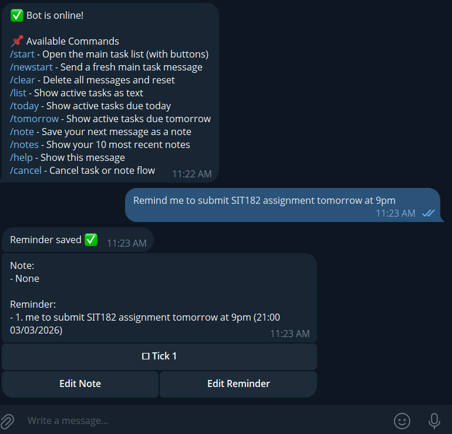
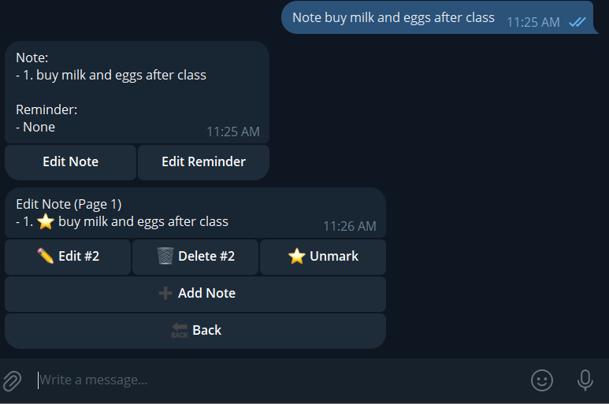

# Bob Task Reminder Bot

Telegram personal assistant bot with a single dashboard message, notes + reminders, edit panels, and Ollama-assisted NOTE/REMINDER classification.

## Screenshots




## What it does

- Keeps one dashboard message per user (stored in `user_main_message`)
- Dashboard always reseats to bottom after updates (except while Edit Note/Edit Reminder panel is open)
- Shows:
  - `Note:` latest notes (with ⭐ marker)
  - `Reminder:` all active reminders in one flat list ordered by due date/time then id
- Tick buttons mark reminders done
- Edit panels:
  - `Edit Note`: Add, Edit, Delete, Toggle Important, pagination
  - `Edit Reminder`: Show done, clear done, tick active reminders

## Input behavior

### Fast prefixes (skip AI)

- `note ...` or `note: ...` -> save note immediately
- `remind ...` or `remind: ...` -> save reminder flow immediately
- Exact `edit note` / `edit note:` -> open Edit Note panel
- Exact `edit reminder` / `edit reminder:` -> open Edit Reminder panel

### AI + fallback classification

- Uses Ollama model `llama3.2` to classify plain text as `NOTE` or `REMINDER`
- If Ollama is unavailable, bot falls back to rule-based local heuristics
- Local date/time parsing is always applied and normalized

### Reminder date/time rules

- Time-only reminder -> asks for date (`awaiting_reminder_date`)
- Date-only reminder -> saves with `due_date`, `due_time = null`
- No date/time -> saves with both null
- Supported natural phrases include:
  - `today`, `tomorrow`, `tmr`, `tonight`
  - `next week` (defaults to Monday)
  - `next week monday`, weekday names
  - `next year`
  - `DD`, `DD/MM`, `DD/MM/YYYY`
  - times like `9am`, `9:30am`, `21:15`

## Requirements

- Python 3.10+
- Telegram bot token
- Optional: local Ollama server for AI classification

## Quick start

```bash
git clone https://github.com/YOUR_USERNAME/bob-task-reminder-bot.git
cd bob-task-reminder-bot
python -m venv .venv
# Windows: .\.venv\Scripts\Activate.ps1
# macOS/Linux: source .venv/bin/activate
pip install -r requirements.txt
```

Copy env file and configure:

```bash
# Windows (PowerShell)
Copy-Item .env.example .env

# macOS/Linux
cp .env.example .env
```

Required `.env` values:

```env
TELEGRAM_BOT_TOKEN=your_bot_token_here
OWNER_USER_ID=your_user_id_here
TASK_BOT_DB_PATH=tasks.db
```

Optional Ollama values:

```env
OLLAMA_HOST=http://localhost:11434
OLLAMA_MODEL=llama3.2
```

Run:

```bash
python bot.py
```

## Commands

- `/start` create/refresh dashboard
- `/newstart` force a fresh dashboard
- `/help` command help
- `/clear` clear temp + dashboard message refs
- `/cancel` cancel current capture flow
- `/note` manual note capture flow
- `/notes` show recent notes text card

## Upcoming update (planned)

I am preparing a bigger AI conversation update so the bot can understand normal, multi-sentence chat and respond naturally before creating items.

Planned behavior:

- User can send normal messages, not only command-like text
- AI will understand context, emotions, and intent from one message
- AI will suggest extracted items (for example: `1 reminder task + 1 note`) and ask for user confirmation before saving
- Bot will reply conversationally, then present a simple confirmation step

Example target flow:

- User: "yesterday my mom just pack me food but I forgot to thanks her, I feel bad, I want to thanks her next time, and also note that my teacher don't like fish"
- Bot (planned): empathetic short reply + proposed extraction:
  - Reminder task: "Thank mom next time"
  - Note: "Teacher doesn't like fish"
- Bot asks for confirmation (yes/no) before creating both items

## Project structure

- `bot.py` main bot logic
- `requirements.txt` dependencies
- `.env.example` config template
- `SETUP.md` setup details
- `.github/workflows/ci.yml` GitHub Actions syntax check

## Publish to GitHub

1. Create an empty GitHub repo
2. Push this project:

```bash
git remote add origin https://github.com/YOUR_USERNAME/YOUR_REPO.git
git add .
git commit -m "Prepare GitHub-ready project"
git branch -M main
git push -u origin main
```

## Security

- Never commit `.env`
- Rotate token if leaked via @BotFather
- Keep `OWNER_USER_ID` private for personal-only bot usage
